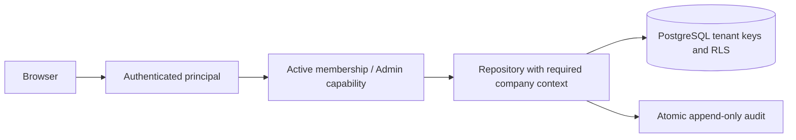

# Admin and company isolation — review draft

Candidate: Shop v104 / Seller v80. This document proposes future Production on one Docker/PostgreSQL server behind Cloudflare Tunnel. It does not activate tenants, credentials, grants, migration or hosting. The current application still has one persistent company and one privileged Seller account. The public Demo continues using its existing SQLite Durable Object namespace.

## Goal and bounded implementation

An Admin must manage companies and Seller memberships while each Seller sees only authorized company products, orders and customer records. Company currency governs new product prices. Historical order/contact/price snapshots remain immutable. No currency conversion, payment, automatic messaging, courier automation or new shipment states are included.

The candidate implements a separate **fictional prototype** at `/demo/` and `/api/v1/demo/`. “Login as Admin” and “Login as Demo Seller” appear only when the server reports `demoRolesAvailable=true`. The API receives no live database, credentials or privileged sessions. Every login creates a fresh in-memory workspace, including two companies, two fictional memberships, 35 products per company with six images, and fictional customers/orders. Login/reset/expiry/exit are session-local. The absolute lifetime is one hour; restart/DO eviction can reset it earlier. Limits: 32 concurrent workspaces, 100 rows per collection, 100 audit entries, 10 starts/minute/client and 128 tracked limiter clients. It is a demonstration with bounded memory, not a durable production tenancy adapter.

The demo cookie has a separate name/path, a random 256-bit token stored by hash, HttpOnly/SameSite=Strict and Secure on HTTPS. Mutation requires same origin plus CSRF. The role/principal comes from the server session. An Admin can create/disable fictional companies/memberships and enter a Seller view; that switch rotates CSRF and reduces privileges. New login creates fresh fiction rather than granting real access. A Demo role never authorizes `/api/v1/seller/*`. Manual/legacy-demo server modes reject Demo APIs and pages, including encoded page paths. Worker-first asset handling is required to enforce this page gate. Docker/Caddy uses a GET-only `/api/v1/demo/availability` preflight before serving any `/demo` asset; the mode-disabled API returns 404 before session handling. Production must run `SHOP_MODE=manual`; the production artifact and reverse-proxy gates require independent verification.

## Proposed production data and invariants

| Record | Ownership and invariant |
| --- | --- |
| `company` | UUID, public shop slug, name, currency, enabled flag, revision. Slug unique; currency immutable while conflicting priced products exist. |
| `principal` | Verified human identity, credential/MFA or approved IdP reference, enabled flag. No demo identity can be promoted. |
| `company_membership` | `(company_id, principal_id)` unique, role and enabled/revocation revision. Admin is an explicit separately reviewed grant. |
| `product`, gallery, category | Required `company_id`; SKU and variant uniqueness scoped to company. Composite parent keys/FKs prevent gallery attachment across companies. |
| customer/contact | Required company ownership; no global phone/email search or deduplication exposed to Sellers. Supplied contact details do not prove identity. |
| order, destination, order item | Required company ID. Composite FK enforces same-company order/product/customer relationships. Snapshots preserve original currency, integer minor amounts and contacts. |
| idempotency/status access | Tenant plus hashed key scope. Receipt/status tokens never reveal another tenant, including if the same client key is reused. |
| session | Hashed opaque token, principal, chosen company, membership revision, expiry/revocation. Company selection is validated against active membership server-side. |
| audit | Append-only actor/company/resource/action/revision/time/correlation ID. Auth failures logged without contact data; business audit commits atomically with mutation. |

Every tenant-owned table uses `NOT NULL company_id`, a composite unique `(company_id,id)`, and composite foreign keys for tenant-owned parents. Products and orders cannot be reassigned by ordinary patches. Money stays integer minor units. Existing price mismatches are quarantined for owner review, never relabelled or converted automatically. A company currency change either passes a no-conflicting-products preflight or fails 409; old orders retain their historical currency even when a future empty catalog uses another currency.

## Proposed authorization and API

One authenticated backend derives `(principal, role, authorized company)` for every request. Ignore client role/company claims except a company selector which is verified against memberships. Sellers use `/api/v1/companies/:companyId/{products,orders,customers,categories,settings}`; every lookup/list/search/count/image/export/document/status mutation binds company in the repository query. A foreign company or foreign resource ID returns the same 404 as absence. Seller settings, customer records and documents require explicit capabilities. Admin control APIs are separate and require Admin role, step-up authentication for grants, revision checks and auditable reasons.

PostgreSQL RLS is defense in depth, not the only authorization check. Use transaction-local company/principal context with `SET LOCAL`, a non-owner restricted application DB role, `FORCE ROW LEVEL SECURITY` where appropriate, and an independently reviewed policy for Admin cross-company work. Connection pools must not retain previous tenant context. A repository method without tenant context must fail closed. Maintenance credentials stay separate from request credentials. Missing membership, disabled company, expired session or revocation blocks the next request, including image and export paths.

Public storefronts resolve a validated slug to company ID before catalog/checkout. Public resources expose only that company's active products; checkout re-loads its current authoritative prices. Tenant-scoped cart/profile/address/receipt databases, service-worker scopes/cache keys and idempotency keys prevent accidental browser mixing when users switch shops. Existing browser data needs an explicit one-company ownership mapping or an owner-approved reset; never silently assign it to a new tenant. Private APIs, credentials and contact snapshots remain outside service-worker caches.

## Migration and rollout gates

1. Identify and freeze the exact source/deployment/database revision, current single-company owner, public slug and membership mapping. Inventory products, gallery bytes/hashes, categories, order/destination/item/audit/idempotency rows and contact retention policy without publishing PII.
2. Back up and restore into an isolated encrypted/off-host copy. Record recovery time, digest and rollback steps. Validate restoration before any live schema changes.
3. Build the PostgreSQL adapter and migration in a disposable environment. Add tenant columns under a staged compatible schema; assign **all** existing rows to exactly one approved company. Backfill product/gallery/order relations with integrity/count/hash checks, then add NOT NULL/composite FKs/RLS. No snapshot, price, currency, contact or old event rewrite.
4. Test old sessions, stale revisions, concurrent grants/revocations, cross-company list/detail/search/count/image/gallery/export/documents/customer/order-confirm/reject/status/idempotency, malformed IDs, impersonation headers, SQL injection and rollback failure. Test pooled-context leakage and a second tenant with identical SKU/customer contact/idempotency keys. Independent security review is required at the exact PR head.
5. Approve the exact migration manifest and built artifact before scheduling live maintenance. During cutover stop old writes, import and reconcile hashes/counts, apply least-privilege grants, verify HTTPS cookies/origin/reverse proxy and health/version. Do not activate new credentials/grants during this draft phase.
6. Verify revocation, tenant isolation, storefront routing, persistence, backups and target devices in the deployed candidate. If rollback is necessary, fence writes, reconcile the new write set and restore the approved snapshot; avoid dual writers or losing accepted orders. Owner approval decides the cutover/rollback procedure.

No live migration is shipped in this candidate. There are no tenant SQL schema changes or new production grants. The synthetic tests prove the separate demo behavior; they do not prove PostgreSQL isolation, migration correctness or production readiness.

## Reliability, monitoring and decisions still open

A single Node backend is the smallest production runtime. Durable PostgreSQL transactions own orders, revisions and audits. Readiness checks schema/persistence, liveness only process health. Use bounded pagination/body limits, per-principal/IP rate limits, correlation IDs and metrics for 401/403/404/409, blocked cross-company attempts, latency, restore age and failed audit transactions; logs omit PII/tokens. Backups, restore exercises and alert ownership require an operational owner before release.

Open review decisions: owner/admin identity provider and MFA, exact capability roles, whether one Seller may hold several company memberships, public slug/domain mapping, separate company customer identity policy, database hosting/backup/RTO/RPO, lawful retention/deletion policy and audited admin emergency access. The prototype supports only one company per fictional Seller membership and ephemeral audit; keep that limitation visible.
