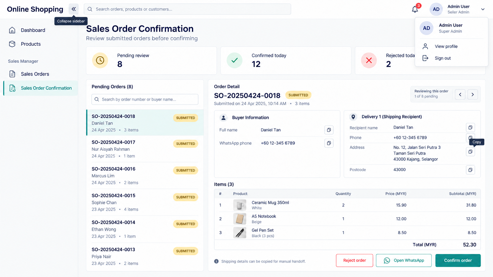
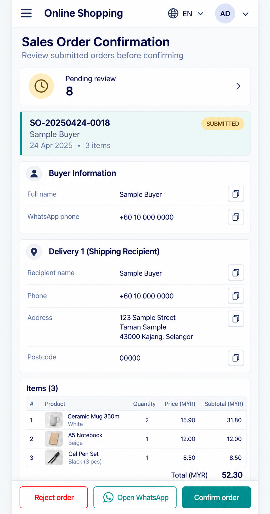

# Seller UI specification

**Status: design reference with seller shell navigation and profile partly implemented; order review is not implemented.** The images are conceptual previews with fictional example orders. Layout and behavior below are the implementation target; image text and numbers are not live data or a final currency decision.

## Approved visual direction

### Desktop preview

### Mobile preview

Use a light background, navy text, teal primary actions, subtle borders, clear status chips, and consistent outline SVG icons. Use a compact set of reusable components: app bar, side navigation, account menu, language menu, order list/card, detail section, copy button, status chip, item list, and action bar. Final implementation must use real SVG assets or inline SVG elements; bitmap icons in these images are visual references only.

## Desktop layout

- At wide widths, show a persistent left side bar and top bar. The side bar contains `Dashboard`, `Products`, and `Sales Manager` with `Sales Orders` and `Sales Order Confirmation`. Highlight the current route.
- A labeled toggle collapses the side bar to an icon rail; it remains usable by keyboard and screen reader. Collapsing does not navigate away or erase the selected order.
- The top bar includes global search where supported, language selection, and an account menu with `View profile` and `Sign out`. The profile shows the authenticated username and role; sign-out invalidates the server session.
- The order confirmation view has a title, optional summary cards, a pending-order list on the left, and the selected order detail on the right. Keep the list and detail separately scrollable when the viewport is short; avoid hiding the review actions.
- Show buyer contact separately from each delivery recipient and destination. Each copy button copies only the adjacent field and reports success or failure. Product rows, quantity, server price snapshot, and total remain visible before a decision.
- Keep `Reject order` visually distinct from `Confirm order`; confirmation and rejection use the same server-backed order status. Show `Open WhatsApp` only for an opted-in buyer; it starts a manual chat and does not itself change order status.

## Mobile layout

- At narrow widths, replace the side bar with a drawer opened by a hamburger button. Dismiss via close button, outside tap, or Escape. Return focus to the trigger when closed.
- The top bar keeps navigation, language selection, and account access. Default UI language is English. The language menu uses the exact order in [PWA and i18n](PWA_I18N.md).
- Present the selected order in one column: summary, buyer contact, one card per delivery, item summary, total, then review actions. Use vertical scrolling and no horizontal page overflow. A pending-order list is a separate view or drawer on small screens so the order detail stays readable.
- Copy buttons and review actions use comfortable touch targets with explicit accessible names. The bottom review bar may remain visible while scrolling, but must not cover the total or the last field; account for safe-area insets.
- For multiple deliveries, repeat recipient/address cards and show the items assigned to each destination. The mobile image illustrates one delivery only.
- In checkout, buyer WhatsApp and each recipient phone field offer Malaysia `+60` and Singapore `+65` country codes, with the same controls on desktop and mobile. Preserve a manually selected phone country when the UI language or delivery address changes. Seller order details display the full normalized number, and copy controls include the country code.

## Essential states and interactions

| Situation | Expected behavior |
| --- | --- |
| No pending orders | Show a clear empty state and a route to all sales orders. |
| Order loading or network error | Show progress or retry without implying a review succeeded. |
| Copy unavailable | Keep the value selectable and show an accessible failure message. |
| Stale order revision | Do not overwrite another seller decision; reload the current order state. |
| Session expired | Protect private details and return to login. |
| Confirmation or rejection | Require an intentional action, show the resulting server state, and update the queue. |
| Offline | Show an offline state; disable submission and review mutations until connectivity returns. |

## Acceptance checks

1. The desktop side bar can expand and collapse without losing the current order; all icons are SVG and have accessible names.
2. The mobile drawer, profile menu, and language menu work with touch and keyboard; `Sign out` invalidates the session.
3. Buyer and recipient copy controls copy the correct individual values and show feedback.
4. Both layouts avoid horizontal overflow at common phone and desktop widths and keep the main review actions reachable.
5. The UI respects the current language and the PWA behavior documented in [PWA and i18n](PWA_I18N.md).
