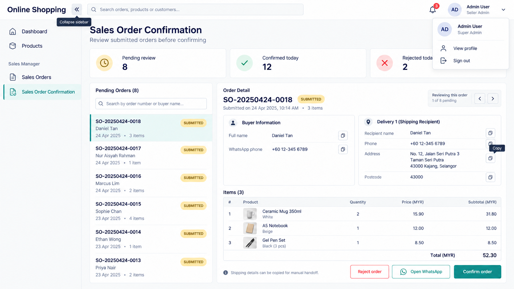
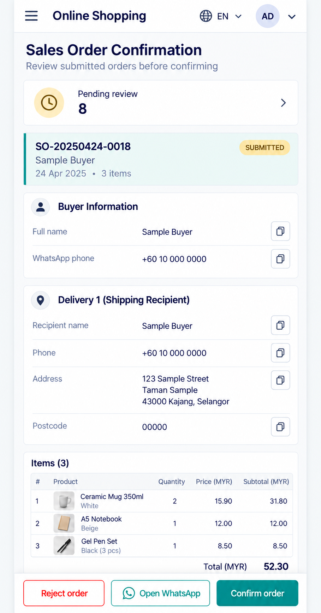

# Web UI specification

**Status: seller navigation, product management, order review, and public shopping journeys run locally.** The seller images below are conceptual previews with fictional example orders. The browser-tested interface uses actual MYR order snapshots; image text and numbers are design references only.

## Public shop layout

The shop uses the owner-supplied storefront image and standalone HTML as layout references. Its header places product search beside Browse, Cart, and language selection. A static message banner uses the first active product image returned by the public API when one exists; the category rail and category selector use the API's active categories. The catalog shows compact cards with active-product images, seller-authored names/descriptions, per-product MYR or SGD prices, detail access, and cart actions. Search and category selection load public API results; the count describes the products currently shown, including paged results. Scrolling near the end automatically loads the next page; a centered Load more button remains as a fallback. Initial loading uses card skeletons, while loading another page shows a compact progress indicator below the existing cards. Failed pagination keeps those cards in place with an inline retry action and offline-specific guidance. The final page shows an end-of-list message. Cart and checkout retain their existing server-backed behavior.

At wide widths, category filtering sits beside a four-column catalog. At smaller widths it becomes a compact row, the header search takes a second line, and product cards use two columns or one at the narrowest phone width. The category rail scrolls horizontally within its own bounds. The product detail dialog keeps a close control, keyboard dismissal, and full description. Unsupported mock content from the reference—ratings, discounts, sales counts, wishlists, accounts, and free-delivery promises—does not appear in the live shop. Only active products and their images come from the backend; the banner does not create a second product source of truth.

## Approved visual direction

### Seller sign-in

The seller login uses the owner-supplied image and standalone HTML as visual references. A wide screen shows a photo introduction beside a raised sign-in card; a narrow screen puts a short introduction above the form so the primary action remains reachable. The original decorative WebP contains no credentials or customer data. The three capability notes describe implemented access control, product management and order review. The username/password labels remain visible, the password visibility button exposes its state and translated accessible name, and native required-field validation keeps focus on the missing field. The attached HTML's demo submit handler and unsupported security or sales claims are not part of the application; the existing server session API remains authoritative.

### Desktop preview

### Mobile preview

Use a light background, navy text, teal primary actions, subtle borders, clear status chips, and consistent outline SVG icons. Use a compact set of reusable components: app bar, side navigation, account menu, language menu, order list/card, detail section, copy button, status chip, item list, and action bar. Final implementation must use real SVG assets or inline SVG elements; bitmap icons in these images are visual references only.

The live seller rail starts at the top of the viewport. Its SVG brand button collapses or expands the desktop rail and closes the phone drawer; the current view remains selected. The top bar sits beside the rail on desktop and spans the screen on phones. Visible shop, seller and login marks use the shared SVG logo. A compact globe button opens the seven-language menu, closes with Escape/outside click, and restores focus after selection. The product editor selects a server-managed category code and a per-product MYR/SGD currency; Company settings controls only the default for new products. A current or newly selected product image is previewed beside an explicit Remove image button; removal is pending until Save and can be undone. Category codes can be created, relabeled or deactivated without deleting products.

The Shop color foundation is defined in `/shop/tokens.css`. Shared UI components use the Shop values when available and retain their previous fallback colors in Seller. Brand controls, prices and totals, neutral surfaces, focus, warnings, errors and success states have separate semantic roles. Shop currently has one fixed palette; Account Settings does not store an appearance preference, and Company settings does not expose brand-color editing.

## Desktop layout

The implemented seller workspace now uses separate panels for the order queue and detail. Each wide-screen panel scrolls within the available viewport height, with its title visible while scrolling. The product list uses two columns where space allows and one column on narrower screens. Product search and add controls sit in their own toolbar. The dashboard remains a placeholder; the conceptual image's counts and global search are not live features.

- At wide widths, show a persistent side bar from the top to the bottom of the viewport. The top bar and content start at its right edge, including when it collapses. The side bar contains `Dashboard`, `Products`, and `Sales Manager` with `Sales Orders` and `Sales Order Confirmation`. Long translated labels wrap inside the rail without creating horizontal scrolling. Highlight the current route.
- A labeled toggle collapses the side bar to an icon rail; it remains usable by keyboard and screen reader. Collapsing does not navigate away or erase the selected order.
- The top bar includes global search where supported, language selection, and an account menu with `View profile` and `Sign out`. The profile shows the authenticated username and role; sign-out invalidates the server session.
- The order confirmation view has a pending-order list on the left and the selected order detail on the right. The page scrolls to the review actions without covering them. `Sales Orders` includes all statuses with order-number search and status filtering; confirmation lists submitted orders only.
- Show buyer contact separately from each delivery recipient and destination. Each copy button copies only the adjacent field and reports success or failure. Product rows, quantity, server price snapshot, and total remain visible before a decision.
- Keep `Reject order` visually distinct from `Confirm order`; confirmation and rejection use the same server-backed order status. Show `Open WhatsApp` only for an opted-in buyer; it starts a manual chat and does not itself change order status.

## Mobile layout

- At widths up to 1080px, selecting an order replaces the queue with a detail page and a Back control. At phone widths, the Back control remains reachable while scrolling. The signed-out layout stacks its introduction and login form without reserving space for the hidden side bar.
- At narrow widths, keep the top bar full width and replace the side bar with a full-height drawer opened by a hamburger button. Dismiss via close button, outside tap, or Escape. Return focus to the trigger when closed.
- The top bar keeps navigation, language selection, and account access. Default UI language is English. The language menu uses the exact order in [PWA and i18n](PWA_I18N.md).
- Present the selected order in one column: total and timestamps, buyer contact, one section per delivery with its item snapshots, history, then review actions. Use vertical scrolling and no horizontal page overflow. Selecting a pending order switches from the list to detail; `Back to orders` restores the list and focus.
- Copy buttons and review actions use comfortable touch targets with explicit accessible names. The bottom review bar may remain visible while scrolling, but must not cover the total or the last field; account for safe-area insets.
- For multiple deliveries, repeat recipient/address cards and show the items assigned to each destination. The mobile image illustrates one delivery only.
- In checkout, buyer WhatsApp and each recipient phone field offer Malaysia `+60` and Singapore `+65` country codes, with the same controls on desktop and mobile. Preserve a manually selected phone country when the UI language or delivery address changes. Explain that WhatsApp is the only buyer order-contact channel; require an actively checked, initially unchecked, order-only permission before submission, with a localized field error. Seller order details display the full normalized number, and copy controls include the country code.
- Checkout phone and address inputs show same-browser saved suggestions only after an explicit save choice on a confirmed order. The combobox supports typing, pointer selection, Arrow keys/Enter, and Escape; choosing an address fills its remaining fields. A clear button removes the saved suggestions without changing the current form.

## Essential states and interactions

| Situation | Expected behavior |
| --- | --- |
| No pending orders | Show a clear empty state and a route to all sales orders. |
| Order loading or network error | Show progress or retry without implying a review succeeded. |
| Copy unavailable | Keep the value selectable and show an accessible failure message. |
| Stale order revision | Do not overwrite another seller decision; reload the current order state. |
| Session expired | Protect private details and return to login. |
| Confirmation or rejection | Require an intentional action, show the resulting server state, and update the queue. |
| Offline | Show an offline state; disable review controls until connectivity returns. A failed request never claims success. |

## Acceptance checks

1. The desktop side bar can expand and collapse without losing the current order; all icons are SVG and have accessible names.
2. The mobile drawer, profile menu, and language menu work with touch and keyboard; `Sign out` invalidates the session.
3. Buyer and recipient copy controls copy the correct individual values and show feedback.
4. Both layouts avoid horizontal overflow at common phone and desktop widths and keep the main review actions reachable.
5. The UI respects the current language and the PWA behavior documented in [PWA and i18n](PWA_I18N.md).

## Shop setup modes

The seller dashboard links to Shop setup in Company settings. A fresh shop offers Demo (35 pet-care listings with images and MYR reference prices) or Production (named shop, manual categories and products). The mode is selected once per database, remains visible after setup, and cannot overwrite existing catalog/order data. The public hero displays the configured shop name; demo shops also show a testing notice. Setup labels are available in all seven shell languages.

Verified locally: both modes through the seller UI, demo pagination to 35 products, all 35 product images decoding, and no horizontal overflow at 390px. The pre-existing missing seller login decoration (`/seller/assets/login-workspace.webp`, HTTP 404) remains unrelated to these flows.

## Demo shopping iteration

Primary job: a visitor completes a simulated pet-product purchase without entering personal information. Flow: catalog → detail (image/name/price/quantity, Add to cart or Buy now) → cart → sample-data checkout → simulated receipt. Seller-only review stays behind existing authentication. Production customers retain normal contact validation.

Detail layout: two columns on desktop (image / purchase summary), one column below 760px; visible close action, native modal keyboard/focus handling, product description and SKU/category below actions. No invented reviews, sales counts, stock, discounts or shipping promises. Demo context appears on every shopping route. Sample checkout fields are read-only, contact permission and saved contact history are hidden, and the server enforces synthetic data independently of the UI.

Acceptance: all 35 sample images load; quantity affects cart and server total; Buy now reaches checkout; double submission replays one receipt; price changes redirect to cart; unavailable items block checkout; closing async detail prevents stale updates; offline failures allow retry. A successful demo receipt and seller confirmation must not create contact permission. Later work: standalone shareable product pages, richer product specifications/gallery, discovery/sorting, company identity/settings and a full customer UX review.

## Product and shopping UX iteration — 2026-09-26

Product details now have stable `/shop/#product/<uuid>` links, with normal anchors on product images/names, direct-load and refresh support, browser back/forward, and same-session catalog search preservation. A dedicated product controller owns fetch lifecycle, quantity, clipboard feedback, image viewer and optional same-category recommendations. Malformed IDs never enter API paths; missing products show an unavailable state, network failures offer Retry, and late responses cannot overwrite another route.

Desktop layout: product image on the left, name/price/quantity/subtotal/purchase/share on the right, description/specifications below, then same-category products. Below 760px the page stacks, with 44px quantity controls and a sticky purchase row within the summary. Image enlargement uses a native modal with close/Escape and focus restoration. Existing product images remain the single source; this iteration adds no invented photos, reviews, stock quantities or delivery claims.

Shopping cards now use uncropped square images and linked titles. Cart lines link back to products and show line subtotals; desktop totals sit in a side panel, stacking on phones. Checkout shows image, unit price, quantity and subtotal per item. Demo contact fields are contained in an initially collapsed, labelled details section; manual checkout stays expanded. The server remains authoritative for actual totals and simulation behavior.

Verified locally at 1280px, 820px and 390px: detail navigation, reload, back/forward, quantity/subtotal, clipboard success, zoom/Escape/focus, Chinese language switch preserving quantity, cart → checkout → demo receipt, missing ID, injected fetch failure → Retry, and delayed response after leaving the detail route. No horizontal overflow in inspected states. Happy-path browser console is clean; the forced network failure generates its expected browser resource error. Node suite: 57 passing tests, plus Worker dry-run build. No external human usability study was performed.

Next iteration candidates: richer seller-maintained specifications, discovery/sorting, company identity and checkout field design for real customers. Hash links work directly but do not provide per-product server-rendered social preview metadata.

Seller-managed products may now have one main image and up to four additional images. The detail page shows a thumbnail strip only when additional images exist. A seller may group separate SKUs as options; the customer switches to the selected SKU's own detail and price before adding it to the cart or buying now. Existing demo products remain single-SKU until their seller supplies real variants and photos. The catalog uses one full-width Add to cart action per card; image and title link to details. Search shows the current query and a clear action while keeping the selected category.

The later mobile detail pass gives the product image the full content width, places the price before the name and keeps Add to cart / Buy now fixed above the five-item navigation at widths up to 760px. The purchase bar follows the navigation's scroll-hide motion and stays clear of the keyboard and image dialog. Quantity remains 1–100; Buy now checks out only the selected quantity, even when the same product already exists in the cart. The checkout keeps that direct intent through Profile setup, re-fetches the product, and still relies on the server's price check before submission.

The current detail hierarchy separates the image gallery, price/name/category/share heading, option and quantity controls, and product information. Product information lists the seller's SKU and category before its description; it does not invent ratings, stock or delivery claims. Multiple images show a count on the main image and selectable thumbnails. Image zoom has an icon close button. The fixed mobile purchase buttons stay available while reading specifications and related products.

For products with multiple images, the customer can use 44px previous/next controls, select a thumbnail, or drag horizontally on the main or enlarged image. Vertical gestures do not switch images or open the viewer. The enlarged viewer also supports left/right arrow keys. On phones, grouped SKU options open from a compact row into a bottom sheet with the current option focused, independent list scrolling, Escape/close controls, and the same option prices as desktop. Selecting an option navigates to that SKU's detail so its own image, price and checkout identity remain authoritative.

The enlarged image viewer stays centered in the viewport after scrolling and shows its current photo count and thumbnails. The mobile option sheet shows each SKU's image and price. Switching within the same variant group retains the selected quantity while loading that SKU's own price and image. On phones, the Shop viewport prevents page pinch zoom and form controls use at least 16px text to avoid iOS input-focus zoom. Product images remain viewable in the dedicated image dialog. OS-level accessibility zoom can still override browser page settings.

## Profile-first, selected-item checkout — 2026-09-26

This flow supersedes the earlier customer multi-destination and prefilled-demo form specification. The goal is a familiar path: save Profile → select cart lines → review one address → place order. The account menu sits immediately right of Language and links to Profile and Settings. Profile requires name plus phone or email; save status and a cart link keep the next step explicit. Settings provides profile access and clearing saved address suggestions; language remains in the header.

Checkout buyer details are semantic read-only text with an Edit profile link. No buyer name or contact is prefilled in Demo. A yellow cart warning blocks checkout until a profile is saved. Profile is local to the browser and unverified, not a customer login. Demo contact/address entries stay on the device; only anonymized placeholders are submitted. Production email-only buyers are accepted without WhatsApp consent; supplied WhatsApp phones retain existing explicit order-contact consent.

Cart selection uses product IDs and persists per tab across refresh. Select all includes indeterminate state. Only selected available products in one currency can proceed; unavailable or mixed-currency unselected products do not block checkout. Buy now takes the quantity chosen on the detail page directly to checkout without changing the cart or its selection. A checkout contains one address, no add-destination control or per-item destination selector. Other addresses require separate transactions. Cart-backed success subtracts submitted quantities rather than clearing the entire cart; direct Buy now success leaves the cart unchanged. Failures preserve selection and cart. A changed direct-purchase price returns to the product; a changed cart price returns to the cart. Checkout submission stays disabled during asynchronous revalidation.

Verified locally: empty profile gate, contact-required error, email-only save/reload, phone edit and normalization, read-only checkout, select/unselect persistence, single-address order, selected-only payload, anonymous Demo request and preservation of unselected items. Chromium console was clean for the successful flow; layouts at 320, 390, 760, 820 and 1280px had no horizontal overflow, with English/Chinese checks. Server tests cover email-only order persistence without WhatsApp permission. Browser profile persistence failure has a unit test and visible error path; customer identity verification and cross-device accounts remain future work.

## Address book, cart and checkout redesign — 2026-09-26

This specification supersedes the preceding form-based checkout and cart side-summary layouts. Profile, My addresses and Settings share an account navigation shell. The address book is a versioned browser-local store with stable IDs and a default address, never inferred from legacy phone/address history. New entries start empty. Saving is explicit; failures retain input. Confirmed deletion of a default promotes the earliest remaining entry.

Cart uses aligned desktop columns and compact mobile rows with selection, 1–100 quantity steppers, subtotal and removal. A fixed measured action bar shows select-all, selected unit count, total and checkout. It supports indeterminate and zero-selection states. The missing-profile warning links to Profile and Save returns to the originating cart with its selection intact.

Checkout is read-only buyer summary → single address summary/change dialog → selected product rows → total and submit. A responsive native dialog becomes a mobile bottom sheet, with native focus containment and Escape. Selection is committed only by Use address or a successful address save. A deleted selected ID blocks submit instead of silently changing destination. New checkouts prefer the default; address data is reread at submission. Shipping, payment, promotion and parcel controls remain out of scope.

Verification: Node tests cover address validation, default fallback, stable IDs/reload, failed persistence, unsupported storage versions and anonymous selected-item request construction. Chrome local walkthrough covered Profile return, empty-address gate, add/select/cancel, deleted-address gate, quantities 1/100/101, zero/partial selection, offline retry, double-click single request and retained unselected items. Responsive checks used 320, 390, 768 and 1280px. Actual phone software-keyboard and installed-PWA behavior require device testing; desktop viewport checks do not establish those results.

## Mobile product-first navigation — 2026-09-26

At widths up to 760px, the header contains only the search row. A five-item bottom navigation provides Home, Category, Cart, Language and Account. Category and Language use native modal bottom sheets with Escape, backdrop dismissal and restored trigger focus. The mobile hero is hidden and the demo notice/category strip are compact so products appear in the first viewport; desktop branding and navigation remain unchanged.

On catalog/product routes, deliberate forward scrolling hides the header and navigation; reverse scrolling or returning near the top reveals them. Focused search, dialogs and transactional routes keep navigation available. Reduced-motion preferences disable transitions. Cart/checkout action bars reserve a separate space above the navigation, with safe-area padding. Language resources and the new navigation module are included in Shop v40 / Seller v44 caches; updating still requires user confirmation.

Validation: 69 Node tests, syntax and Worker bundle checks passed. In-app Chromium checks covered 320/390px mobile, 768/1280px desktop, forward/reverse scroll, Chinese language selection, category filtering, cart badge, bottom-of-cart spacing, Account navigation and Escape/focus return; no console warnings/errors were captured. The external Chrome adapter timed out, so these responsive checks used the in-app browser. Actual phone keyboard and installed-PWA upgrade interaction remain device-test limitations.

## Mobile product detail page — 2026-09-27

At widths up to 760px, the product image starts at the viewport top in a full-width 1:1 square. A fixed transparent navigation row overlays it with 44px Back, Share and Cart controls. Once the gallery has scrolled past that row, the same row gains a white background over 200ms, so no second header enters the layout. The catalog search header and five-item bottom navigation are hidden only on this route. The product action dock remains fixed with equal-width Add to cart and Buy now buttons; its background and page padding include the bottom safe-area inset. Desktop keeps its two-column detail layout and normal site header.

The content shows server-backed price, title, category, selectable variants, quantity, product details and description. The API has no promotions, ratings, sold count, shipping promise, return policy, reviews or public seller chat endpoint, so the detail page does not show empty placeholders or a nonfunctional Chat action for them. Seller-authored description, SKU, category, images, variants and price remain API-owned. The existing Add to cart and direct Buy now paths retain their behavior.

Local Chrome measurements at 320×700 and 390×844 showed square 320/390px media, 44×44px floating controls, 52px dock buttons, no document overflow, a white bar after scroll, and the last related card above the dock at maximum scroll. Chat opened an accessible dialog. The 86-test suite and syntax check passed. Real iOS Safari safe-area behavior still needs device verification.
